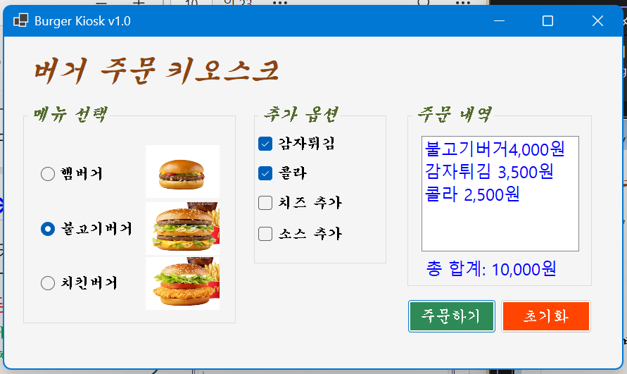
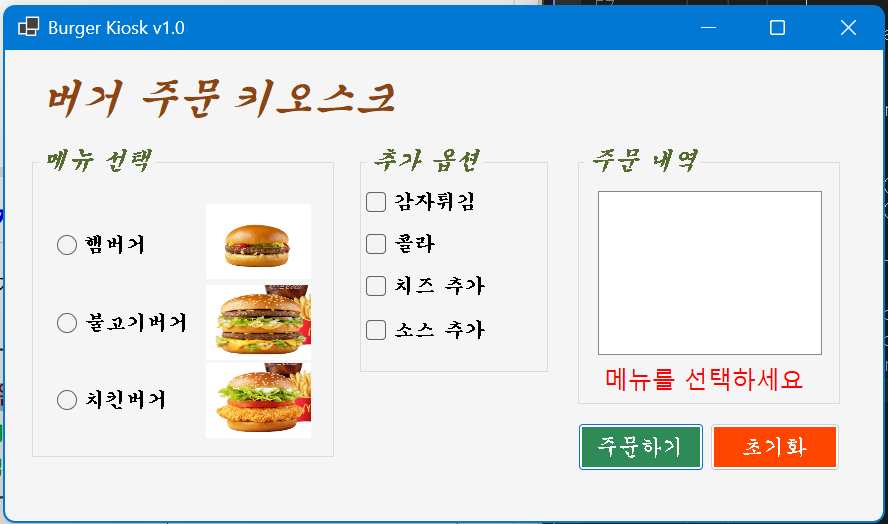
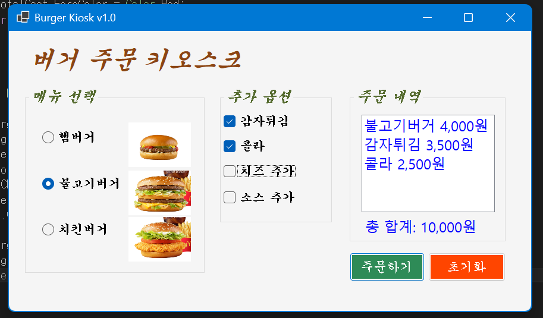
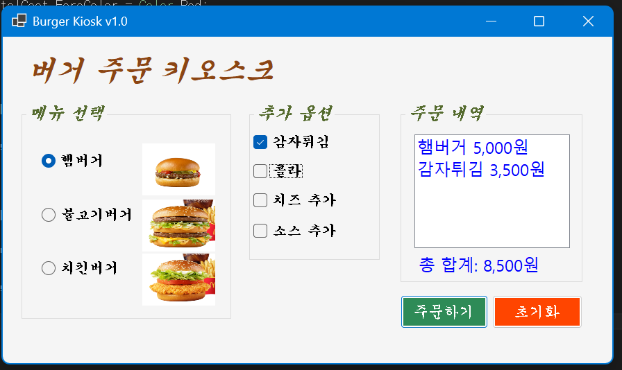

# (C샵 코딩) 버거 키오스크

## 개요
- C# 프로그래밍 학습
- 1줄 소개: 버거와 추가옵션을 원하는 대로 주문하고 총 금액을 확인할 수 있는 프로그램
- 사용한 플랫폼: 
	- C#, .Net Windows Forms, Visual Studio, GitHub
- 사용한 컨트롤: 
	- Label, RadioButton, CheckBox, GroupBox, ListBox, Button, PictureBox
- 사용한 기술과 구현한 기능: 

## 실행화면
- 코드의 실행 스크린샷과 구현 내용 설명

- 구현한 내용 (위 그림 참조)
	- 전체적인 UI 설정을 함.  Label, RadioButton, CheckBox, GroupBox, ListBox, Button, PictureBox 컨트롤을 배치함.
	- 처음 실행 화면에서 햄버거 종류 radiobutton 하나가 미리 선택되어 있는 상황을 제거함. -> formload에서 checked False
	- 각 메뉴의 값을 설정하고 사용자가 선택하면 totalCost 변수에 값이 더해져 '주문하기' 버튼을 누르면 lblToalCost에 총 합계가 뜨도록 함. 동시에 선택한 각 메뉴들과 그 금액이 lstOrder에 표시되도록 함.

## 실행화면
- 코드의 실행 스크린샷과 구현 내용 설명

- 구현한 내용 (위 그림 참조)

## 실행화면
- 코드의 실행 스크린샷과 구현 내용 설명

- 구현한 내용 (위 그림 참조)

## 실행화면
- 코드의 실행 스크린샷과 구현 내용 설명

- 구현한 내용 (위 그림 참조)

